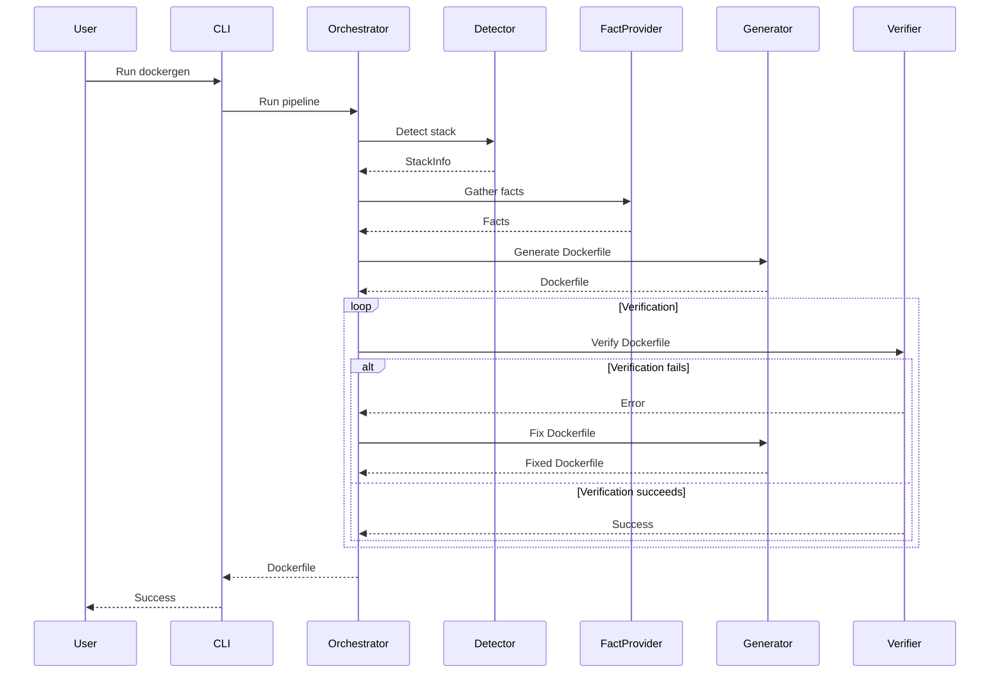

# Dockerfile Generator

A tool to automatically generate Dockerfiles for your projects using AI.

## Installation

```bash
go install github.com/doorcloud/door-ai-dockerise/cmd/dockergen@latest
```

## Usage

### Basic Usage

Generate a Dockerfile for a project in the current directory:

```bash
dockergen
```

### Advanced Usage

Generate a Dockerfile for a specific project directory:

```bash
dockergen --path ./repo
```

Generate a Dockerfile using a specific LLM provider:

```bash
# Using Ollama
dockergen --path ./repo --llm ollama

# Using OpenAI
dockergen --spec stack.yaml --llm openai --verbose
```

### Options

- `--path`: Path to the project directory (default: ".")
- `--spec`: Path to stack specification file (yaml/json)
- `--llm`: LLM provider to use (openai|ollama) (default: "openai")
- `--verbose`: Enable verbose logging
- `--debug`: Enable debug logging

## Configuration

### OpenAI

To use OpenAI, set the `OPENAI_API_KEY` environment variable:

```bash
export OPENAI_API_KEY=your-api-key
```

### Ollama

Ollama should be running locally on the default port (11434).

## Development

### Building

```bash
go build -o dockergen ./cmd/dockergen
```

### Testing

```bash
go test ./...
```

## License

MIT 

## Architecture

### Flow Diagram



### Retry Flow

The orchestrator implements a retry mechanism for Dockerfile verification without re-detecting the stack. This flow is used when:

1. The initial Dockerfile generation fails verification
2. The stack information is already known (either from detection or spec)

The retry flow follows these steps:

1. Generate initial Dockerfile
2. Verify the Dockerfile
3. If verification fails:
   - Use the generator's Fix method to improve the Dockerfile
   - Retry verification with the fixed Dockerfile
   - Repeat up to the configured number of attempts
4. If all attempts fail, return the last error

The retry mechanism is configurable through the `attempts` parameter in the Orchestrator options. 